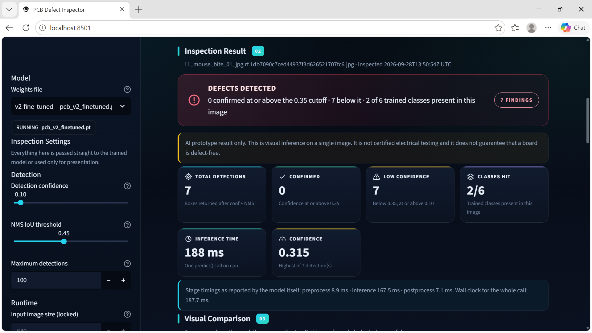
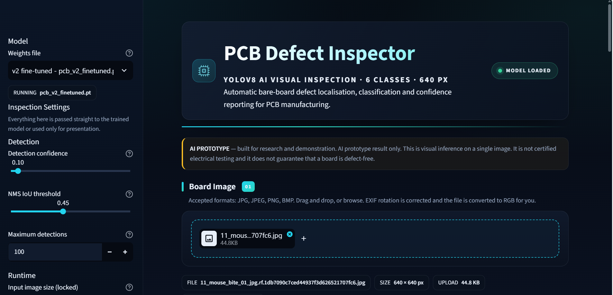
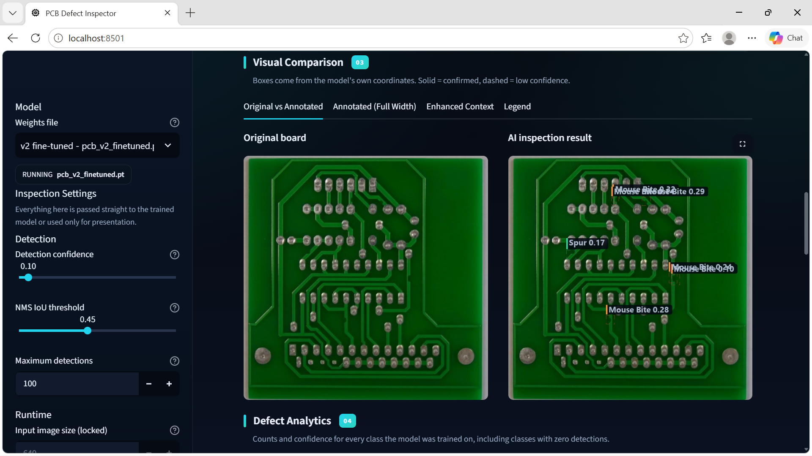
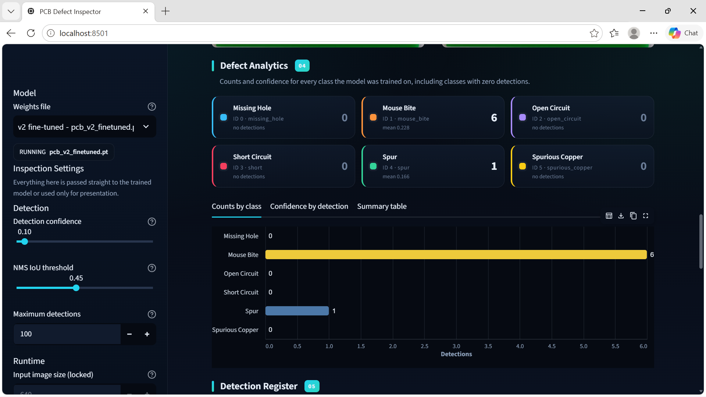
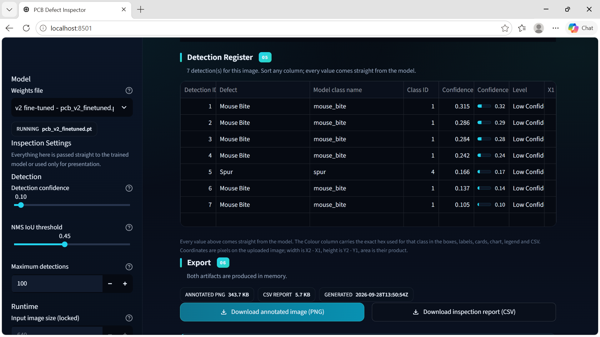
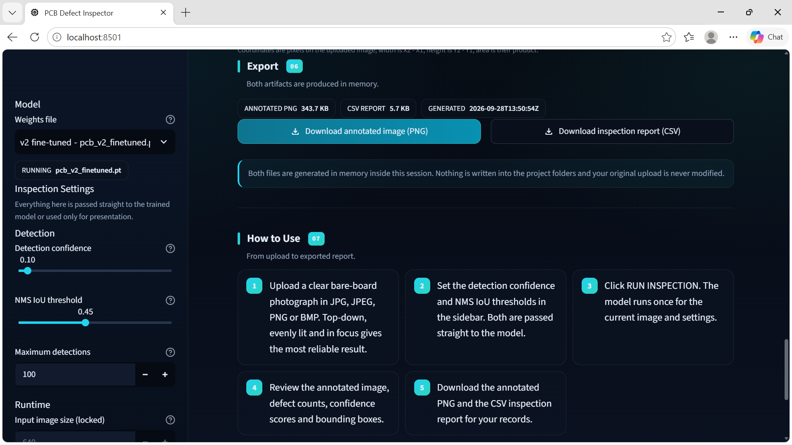
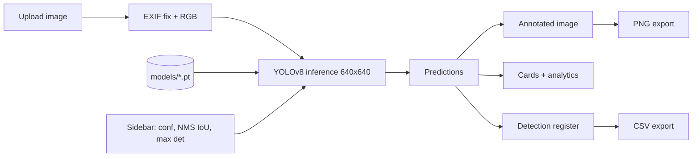

<div align="center">

# PCB Defect Inspector
### YOLOv8-Powered AI Visual Inspection System

Upload a printed-circuit-board image, run a trained YOLOv8 model, and review detected defect locations, confidence values, class analytics and exportable reports in a dark-themed Streamlit dashboard.
### 🚀 Live Demo
**Try the PCB Defect Inspector:** [Launch the Live Application](https://pcb-ai-defect-inspector-rishi.streamlit.app)


-blue)



</div>


---

## Table of Contents
1. [Overview and motivation](#1-overview-and-motivation)
2. [Problem statement and objectives](#2-problem-statement-and-objectives)
3. [Features](#3-features)
4. [The user interface](#4-the-user-interface)
5. [Dashboard walkthrough](#5-dashboard-walkthrough)
6. [System architecture](#6-system-architecture)
7. [Inference pipeline](#7-inference-pipeline)
8. [YOLOv8 and object detection](#8-yolov8-and-object-detection)
9. [Defect classes](#9-defect-classes)
10. [Dataset](#10-dataset)
11. [Training and evaluation](#11-training-and-evaluation)
12. [Metrics and how to read them](#12-metrics-and-how-to-read-them)
13. [Installation](#13-installation)
14. [Model weights](#14-model-weights)
15. [Run the app](#15-run-the-app)
16. [Usage guide](#16-usage-guide)
17. [Settings explained](#17-settings-explained)
18. [Sample output and interpretation](#18-sample-output-and-interpretation)
19. [Repository structure](#19-repository-structure)
20. [Licensing](#20-licensing)
21. [Privacy, security, limitations](#21-privacy-security-limitations-and-responsible-use)
22. [Roadmap](#22-roadmap)
23. [Acknowledgements](#23-acknowledgements)
24. [Author](#24-author)

---

## 1. Overview and motivation
PCB fabrication defects can affect connectivity, assembly and reliability. Manual visual inspection is slow and varies with operator, lighting and image quality. This project explores computer-vision assistance: a YOLOv8 detector localises and classifies six bare-board defect types, and a Streamlit dashboard makes the model usable from a browser without running scripts.

## 2. Problem statement and objectives
**Problem:** locate and classify visible PCB defects in an image and present the result in a reviewable, exportable form.

**Objectives (from the project report):** build a YOLOv8 inspection workflow; detect six defect categories; provide an interactive dashboard showing classes, confidence and bounding boxes; organise training/evaluation/audit scripts; prepare the project for reproducible sharing.

## 3. Features
Verified from the dashboard screenshots:

- Weights selector with loaded-model status ("MODEL LOADED", "RUNNING `<file>`")
- Image upload: JPG, JPEG, PNG, BMP; EXIF rotation correction and RGB conversion (stated in the UI)
- Sidebar controls: detection confidence, NMS IoU threshold, maximum detections; input size locked at 640 px
- Summary cards: total detections, confirmed, low confidence, classes hit, inference time, top confidence, plus stage timings
- Visual comparison tabs: Original vs Annotated, Annotated (Full Width), Enhanced Context, Legend; solid boxes = confirmed, dashed = low confidence
- Class analytics for all six classes (including zero counts) with Counts-by-class, Confidence-by-detection and Summary-table views
- Sortable detection register
- Export of annotated PNG and CSV report, generated in memory
- Built-in "How to Use" guide and prototype disclaimer

Not verified (source not supplied): batch/folder processing, video or camera input, authentication, persistence.

## 4. The user interface
A dark navy theme with cyan accents. A fixed left sidebar holds model and inspection settings. The main column is a vertical, numbered workflow: a header card with a **MODEL LOADED** badge and an amber **AI PROTOTYPE** notice, then sections **01 Board Image -> 02 Inspection Result -> 03 Visual Comparison -> 04 Defect Analytics -> 05 Detection Register -> 06 Export -> 07 How to Use**. Result cards use coloured accent edges, and each class has a consistent colour across boxes, cards, charts, legend and CSV (as stated in the app).

## 5. Dashboard walkthrough

### 5.1 Model selection, settings and upload

The sidebar shows `pcb_v2_finetuned.pt` running, confidence 0.10, NMS IoU 0.45, max detections 100. The uploaded file is a 640 x 640 px, 44.8 KB JPG.

### 5.2 Inspection summary

"Defects detected" banner with 0 confirmed at the 0.35 cutoff, 7 below it, 2/6 classes hit, 188 ms and top confidence 0.315. A stage-timing line reports preprocess 8.9 ms, inference 167.5 ms, postprocess 7.1 ms, whole call 187.7 ms.

### 5.3 Original vs annotated

Original board beside the annotated result, drawn from the model's own coordinates.

### 5.4 Defect analytics

Six class cards (Mouse Bite 6, Spur 1, the rest 0) and a bar chart.

### 5.5 Detection register

Seven rows with Detection ID, Defect, Model class name, Class ID, Confidence (numeric and bar) and Level. Box coordinates are pixels on the uploaded image (width = X2-X1, height = Y2-Y1).

### 5.6 Export and workflow

Annotated PNG (343.7 KB) and CSV report (5.7 KB) downloads. The app states files are generated in memory, nothing is written to project folders, and the original upload is never modified.

## 6. System architecture
> Derived from the report and UI; `dashboard/app.py` internals were not audited. See [docs/architecture.md](docs/architecture.md).



## 7. Inference pipeline
PCB image upload -> validation and preparation -> YOLOv8 inference -> confidence filtering and NMS -> classes and boxes -> annotated image, analytics, register, exports (report, section 4).

## 8. YOLOv8 and object detection
*Background:* YOLOv8 (Ultralytics) is a single-stage detector that predicts class labels, confidence scores and bounding boxes in one forward pass; non-maximum suppression removes overlapping duplicates.
*This project:* a YOLOv8 model trained on six PCB defect classes, run through Ultralytics at 640 px. The exact model size (n/s/m/l/x) and training settings are **not documented in the supplied materials**.

## 9. Defect classes
| ID | Display label | Model class name |
|---:|---|---|
| 0 | Missing Hole | `missing_hole` |
| 1 | Mouse Bite | `mouse_bite` |
| 2 | Open Circuit | `open_circuit` |
| 3 | Short Circuit | `short` |
| 4 | Spur | `spur` |
| 5 | Spurious Copper | `spurious_copper` |

Class names in a model do not prove reliable per-class detection.

## 10. Dataset
YOLO-style train/validation/test folders with `dataset/data.yaml`. Reported counts: **1,800 train / 62 validation / 31 test** images. **Source and licence: not verified** - see [dataset/README.md](dataset/README.md). The dataset is not included in this repo.

## 11. Training and evaluation
Trained with Ultralytics YOLOv8; training/eval/benchmark/dataset-audit/leakage-check/image-size-sweep scripts are listed in the report under `src/` (not supplied here). Epochs, batch size, optimizer, seed and hardware are **not recorded in the supplied materials**; add them from your actual runs. Details: [docs/methodology-and-evaluation.md](docs/methodology-and-evaluation.md).

## 12. Metrics and how to read them
Historical validation metrics recorded earlier in the project (not re-computed; validation split of 62 images):

| Precision | Recall | mAP@50 | mAP@50-95 |
|---:|---:|---:|---:|
| 0.702 | 0.650 | 0.738 | 0.297 |

- It is **unconfirmed which weights** these belong to (`pcb_best.pt` in the report vs `pcb_v2_finetuned.pt` in the screenshots). Re-run evaluation on the weights you publish.
- The screenshot numbers (7 detections, top confidence 0.315, ~188 ms) are one image on one run - **not** accuracy or benchmark speed.
- Confidence scores are model outputs, not calibrated probabilities. No detection does not mean defect-free.

## 13. Installation
Intended environment: Windows, Python 3.12, virtual environment. *(Commands unverified here - see [docs/installation.md](docs/installation.md).)*

**Windows PowerShell**
```powershell
git clone https://github.com/<YOUR-USERNAME>/<YOUR-REPOSITORY>.git
cd <YOUR-REPOSITORY>
py -3.12 -m venv .venv
.\.venv\Scripts\Activate.ps1
python -m pip install --upgrade pip
pip install -r requirements.txt
```
**Linux/macOS**
```bash
python3.12 -m venv .venv && source .venv/bin/activate
pip install -r requirements.txt
```

## 14. Model weights
Weights are git-ignored by default. Place `pcb_v2_finetuned.pt` (and/or `pcb_best.pt`) in `models/`. See [models/README.md](models/README.md) for size limits, LFS and licensing.

## 15. Run the app
From the repository root:
```powershell
python -m streamlit run dashboard\app.py
```
Open the printed URL, commonly `http://localhost:8501` (local only; not a public deployment).

## 16. Usage guide
1. Pick weights in the sidebar.  2. Upload a clear top-down board image.  3. Set confidence / NMS IoU / max detections.  4. Click **RUN INSPECTION**.  5. Review summary, comparison, analytics and register.  6. Download the PNG and CSV. Full guide: [docs/user-guide.md](docs/user-guide.md).

## 17. Settings explained
| Setting | Meaning |
|---|---|
| Detection confidence | Minimum score to return a box; lower gives more boxes and more false positives |
| NMS IoU threshold | Overlap level at which duplicate boxes are suppressed |
| Maximum detections | Cap on boxes per image |
| Inference time | Predict-call duration on the current machine; hardware-dependent |

## 18. Sample output and interpretation
In the demo run (confidence 0.10), all 7 boxes were below the 0.35 cutoff (top score 0.315): six Mouse Bite and one Spur. That means the model was unsure, not that defects were confirmed. A reviewer should inspect the flagged regions and compare with known ground truth; the demo image's ground truth was not shown.

## 19. Repository structure
```text
PCB-Defect-Inspector/
├── README.md
├── LICENSE                      # AGPL-3.0 text (proposed - confirm)
├── CONTRIBUTING.md
├── CITATION.cff
├── .gitignore
├── requirements.suggested.txt   # unverified; replace with your real requirements.txt
├── assets/screenshots/          # 6 real dashboard screenshots
├── docs/                        # architecture, evaluation, guide, install, deployment, licensing, limitations
├── models/README.md             # + your *.pt (git-ignored)
├── dataset/README.md            # + your data.yaml
├── dashboard/app.py             # YOUR existing app (not included in this package)
└── src/                         # YOUR existing scripts (not included in this package)
```

## 20. Licensing
Proposed repository licence: AGPL-3.0 (compatible with Ultralytics). Dataset and weight licences must be confirmed. See [docs/licensing.md](docs/licensing.md).

## 21. Privacy, security, limitations and responsible use
Exports are created in memory per the app; do not upload confidential boards to a public deployment. Do not commit secrets, `.env`, datasets or local paths. Limitations are listed in [docs/limitations.md](docs/limitations.md). Human review is required.

## 22. Roadmap
Re-evaluate the published weights on a representative labelled test set; balance under-represented classes; report per-class P/R/AP, confusion matrix and latency; choose thresholds from validation data; add tests (model loading, paths, inference, CSV); include model version and settings in exports; improve input validation; explore model optimisation; document dataset provenance.

## 23. Acknowledgements
[Ultralytics YOLOv8](https://github.com/ultralytics/ultralytics), [Streamlit](https://streamlit.io), PyTorch, OpenCV and the  PCB dataset authors.

## 24. Author
**Rishi P** - Electronics and Communication Engineering
