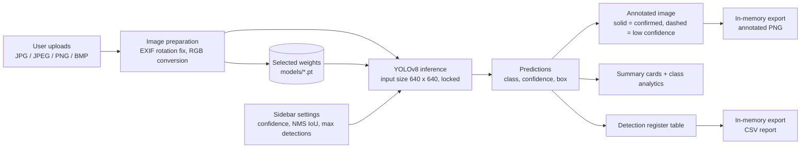

# Architecture

> Derived from the project report and what is visible in the dashboard screenshots. `dashboard/app.py` was **not supplied**, so internal function/module structure is not documented here.

## Runtime facts visible in the UI
- Streamlit app served locally at `localhost:8501`.
- Sidebar: weights dropdown, "RUNNING <file>" indicator, detection confidence, NMS IoU threshold, maximum detections, locked input size (640 px).
- Sections numbered 01-07: Board Image, Inspection Result, Visual Comparison, Defect Analytics, Detection Register, Export, How to Use.
- Result header reports stage timings (preprocess / inference / postprocess) and whole-call wall clock; the demo run was labelled as executed on CPU.
- Export files are generated in memory; the UI states nothing is written to project folders and the original upload is never modified.

## Not verified
Model-loading and caching strategy, error handling for missing weights/unsupported files, CSV column list beyond what is visible, and the meaning of the "confirmed" cutoff (0.35 in the demo) - whether fixed or configurable.
